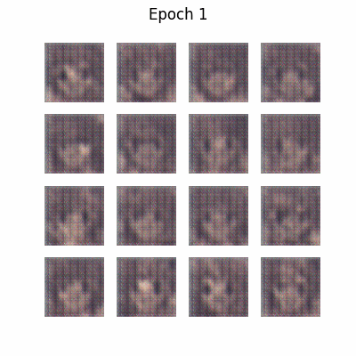
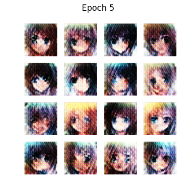
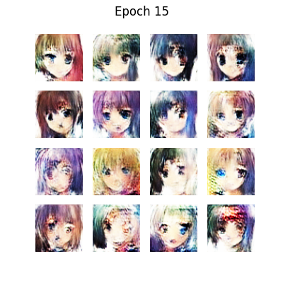
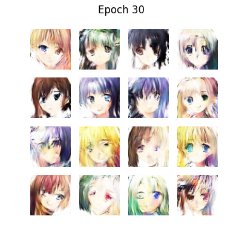

## Anime Faces Generator

### Overview

This project implements a Deep Convolutional Generative Adversarial Network (DCGAN) in TensorFlow/Keras to generate novel anime-style faces. By training on a curated dataset of ~21 k anime character portraits (cropped and resized to 64×64 px), the GAN learns to map a 100-dimensional latent vector to realistic-looking anime faces. The entire pipeline—from data ingestion through model definition, training, and image sampling—is contained in this repository.

 

### Project Flow

1. **Data Preparation**  
   - Download anime face images (21 551 samples) from the “Anime Faces” dataset.  
   - Crop to facial regions and resize all images to 64×64 pixels.  
   - Normalize pixel values to \[-1, +1\] for GAN training.

2. **Model Definition**  
   - **Generator:**  
     - Input: 100-dimensional noise vector.  
     - Upsampling path: series of `Conv2DTranspose` layers with increasing spatial resolution (4→8→16→32→64), each followed by BatchNorm + ReLU, ending in a 64×64×3 `tanh` output.  
   - **Discriminator:**  
     - Input: 64×64×3 image.  
     - Downsampling path: series of `Conv2D` layers with LeakyReLU activations and Dropout, reducing to a single scalar probability via a final dense layer with `sigmoid`.

3. **Training Loop**  
   - Batch size: 256  
   - Latent dimension: 100  
   - Optimizer: Adam (learning rate 2e-4, β₁ = 0.5)  
   - Number of epochs: 50  
   - At each step:  
     1. Sample a batch of real anime faces and a batch of random noise.  
     2. Update the discriminator on real vs. generated (“fake”) images.  
     3. Update the generator via its ability to fool the discriminator.  
   - Periodically save checkpointed model weights and sample grids of generated faces.

4. **Sampling & Visualization**  
   - After every N epochs (e.g. 5), generate a 5×5 grid of new faces from fixed noise vectors.  
   - Plot and save loss curves for both generator and discriminator.

### Key Features

- **Custom DCGAN Architecture**  
  Lightweight yet expressive convolutional generator and discriminator networks tailored for 64×64 anime faces.

- **TensorFlow 2.x / Keras**  
  Leverages the `tf.GradientTape` API for full control over training; easily extensible.

- **Flexible Hyperparameters**  
  Easily adjust latent dimension, batch size, learning rates, and number of epochs via the configuration section.

- **Built-in Visualization**  
  Automatic generation of sample image grids and loss plots to monitor training progress.

- **Checkpoints & Resume**  
  Save and load model weights to resume long-running training jobs.

### Results

After 50 epochs of training:

- The generator produces high-quality anime faces with coherent hair styles, facial features, and coloring.
- Loss curves demonstrate stable adversarial training:  
  
- Sample outputs (5×5 grid at epochs 5, 15, 30):  
    
    
  

 

### Repository Contents
- **`anime-faces-generator-gan-using-tensorflow.ipynb`**: Jupyter Notebook with full code, visualizations and explanations.
- **`Data`:** Contains the [Original Dataset](https://www.kaggle.com/datasets/splcher/animefacedataset) and you can see the cleaned dataset in notebook.
- **`README.md`:** Project documentation.

 

### How to Contribute
Contributions are welcome! If you'd like to improve the project or add new features:

1. **Fork the repository.**
2. **Create a new branch.**
3. **Make your changes and submit a pull request.**
